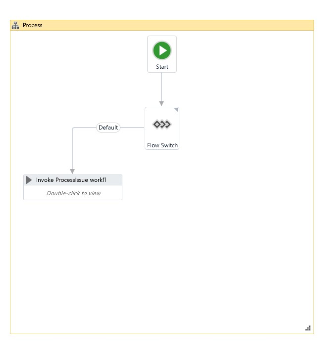
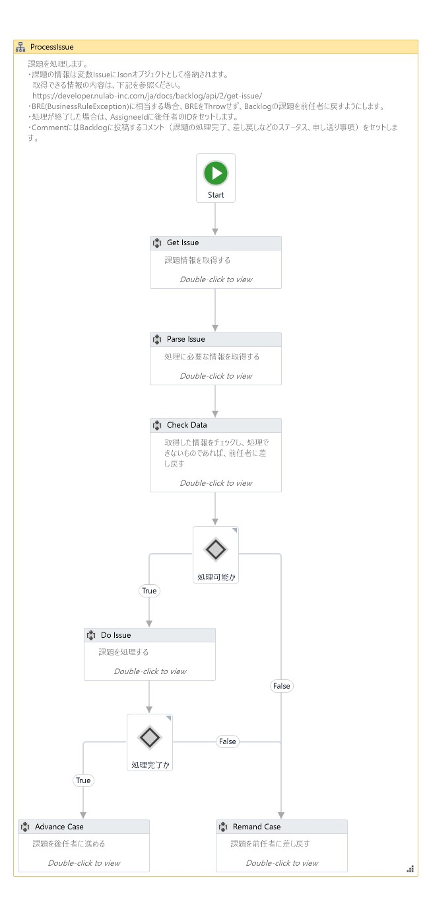

# ReFramework Template Backlog Transaction

Backlogの課題をトランザクションとして処理するワークフローテンプレート

## 内容

Backlogで管理している課題を自動処理するロボットを作成するためのテンプレートです。
指定されたプロジェクト（複数）を監視し、自分に割り当てられた「未対応（ID:1）」「処理中（ID:2）」の課題を取得しトランザクションとして処理します。このテンプレートを活用することにより、人 - ロボット - 人といった作業の連携が容易に実現できます。

* 処理内容は、課題の情報から取得するものとします。
* 処理が成功した場合には、課題のステータスを「処理済み（ID:3）」として後任者に送り、BREに相当するエラーの場合は、前任者に差し戻します。

## 設定

Data¥Condig.xlsxで以下の設定ができます。

Settingタブ

| Name                     | Default                    | Description                                                                                  |
|:-------------------------|:---------------------------|:---------------------------------------------------------------------------------------------|
| logF_BusinessProcessName | Framework Backlog Template | ワークフローの名称（ログに出力されます）                                                     |
| Backlog_SpaceName        | -                          | スペース名（https://<Space Name>.backlog.jp）                                                |
| Backlog_APIKey           | -                          | APIキー                                                                                      |
| Backlog_ProjectIDs       | -                          | 対象のプロジェクトID（複数ある場合は、 <Project ID>,<Project ID>のようにカンマ区切りで列挙） |
| Backlog_AssigneeIDs      | -                          | 処理する課題の担当者                                                                         |
| Backlog_WorkFolder       | Data\Work                  | 課題の添付ファイルをダウンロードする作業フォルダ                                             |

Constantsタブ

| Name           | Default | Description  |
|:---------------|:--------|:-------------|
| MaxRetryNumber | 3       | リトライ回数 |

## 利用方法

1. テンプレート一式をダウンロードします。

2. project.jsonの"name","description"を修正します。

3. Data¥Config.xslxにワークフローの名称、Backlogのスペース名、APIキー、プロジェクトIDリスト、担当者を設定します。

4. Process.xamlを実装します。
  対象のプロジェクトIDが複数ある場合は、ProcessIssue.xamlをコピーして複数用意し、Process.xamlでProcessID毎に別のProcessIssue.xamlを呼び出すようにします。

    

5. ProcessIssue.xamlを実装します。
  * Parse Issueの実装
    課題（Issue）の内容から処理に必要なデータを取得します。添付ファイルがあれば、作業フォルダにダウンロードします。
  * Check Dataの実装
    取得したデータをチェックします。処理が継続できない場合（Business Rule Exceptionに相当）は、BREをThrowするのではなく、AdvanceIssueをFalseに設定して、課題を前任者に差し戻します。処理を継続するものの、申し送り事項がある場合は、Commentに内容を記載します。
  * Do Issueの実装
    取得した情報に基づき、処理を行います。処理が正常に終了した場合には、後任者のIDをAssigneeIdにセットします。処理が失敗した場合（Business Rule Exceptionに相当）は、BREをThrowするのではなく、AdvanceIssueをFalseに設定して、課題を前任者に差し戻します。System Exceptionの場合は上位のワークフローでリトライ処理を行います。
    申し送り事項がある場合は、Commentに内容を記載します。

    
